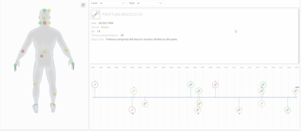

# Injury Viewer 

#### Linguaggi Visuali per Sistemi Complessi
#### Final exam project

Injury data visualization project based on: 

- p5.js (Processing.js javascript version) ["https://p5js.org/"](https://p5js.org/)
- babylon.js (webgl engine) ["https://www.babylonjs.com/"](https://www.babylonjs.com/)
- some vanilla javascript ["http://vanilla-js.com/"](http://vanilla-js.com/)

## Project page

See project page for more:

["https://michele-castenetto.github.io/injury-viewer/"](https://michele-castenetto.github.io/injury-viewer/)

## Run project

npm install && npm start

